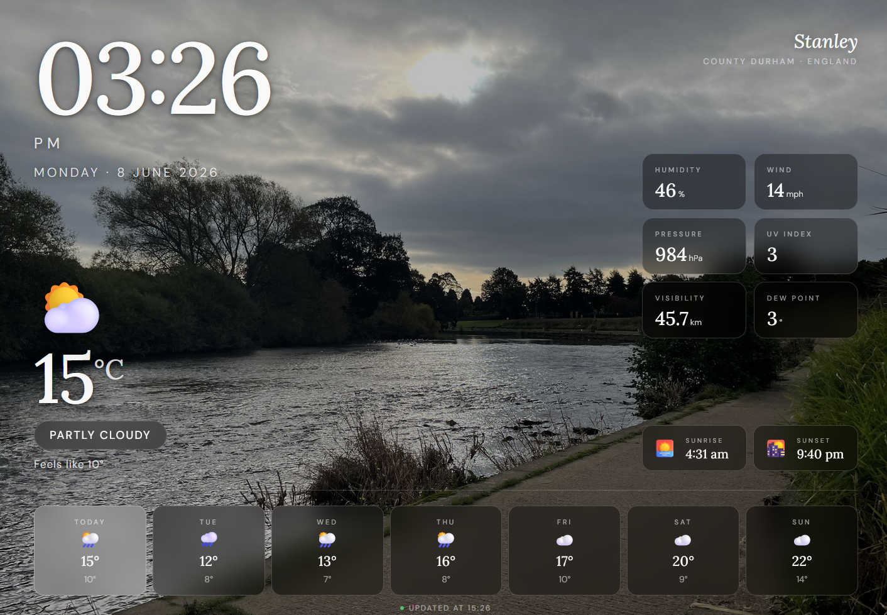

# Pi Weather Dashboard — Setup Guide



A full-screen weather dashboard for a 1080p display. Shows a live clock, current conditions, stats, sunrise/sunset, and a 7-day forecast, with background images that change to match the weather. Data comes from the free Open-Meteo API — no account or API key needed.

**Tested on:** Raspberry Pi 4B  
**OS:** Raspberry Pi OS Trixie (current release, October 2025)

---

## File Structure

The `weather-images/` folder must sit **next to** the HTML file:

```
/home/<yourname>/dashboard/
├── weather-dashboard.html
└── weather-images/
    ├── clear-day.jpg
    ├── clear-night.jpg
    ├── cloudy-day.jpg
    ├── cloudy-night.jpg
    ├── rain-day.jpg
    ├── rain-night.jpg
    ├── snow-day.jpg
    ├── snow-night.jpg
    ├── storm-day.jpg
    ├── storm-night.jpg
    ├── fog-day.jpg
    └── fog-night.jpg
```

---

## Step 1 — Flash Raspberry Pi OS Trixie

1. Download **Raspberry Pi Imager** from [raspberrypi.com/software](https://www.raspberrypi.com/software/)
2. Choose:
   - **Device:** Raspberry Pi 4B
   - **OS:** Raspberry Pi OS (64-bit) — this will be Trixie, the current release
   - **Storage:** your SD card
3. Click the **gear/settings icon** and configure:
   - Hostname (e.g. `dashboard`)
   - Username and password
   - Wi-Fi credentials
   - Enable SSH
4. Flash, insert into Pi, boot

---

## Step 2 — Initial Setup

SSH in and run a full update first:

```bash
sudo apt update && sudo apt upgrade -y
```

Install the emoji font and `unclutter` (hides the mouse cursor on screen):

```bash
sudo apt install -y fonts-noto-color-emoji unclutter
```

### Switch to X11

Trixie uses Wayland by default, which breaks screen-blanking control and some kiosk behaviour. Switch to X11:

```bash
sudo raspi-config
```

→ **Advanced Options** → **Wayland** → **X11** → reboot

---

## Step 3 — Copy Dashboard Files

From your main computer:

```bash
# Create folders on the Pi
ssh <yourname>@<pi-ip-address> "mkdir -p ~/dashboard/weather-images"

# Copy the dashboard
scp weather-dashboard.html <yourname>@<pi-ip-address>:~/dashboard/

# Copy your images
scp /path/to/images/*.jpg <yourname>@<pi-ip-address>:~/dashboard/weather-images/
```

Or use `scp` for the whole folder at once:

```bash
scp -r dashboard/ <yourname>@<pi-ip-address>:~/
```

---

## Step 4 — Background Images

You need 12 JPEG images in `weather-images/` with these exact filenames (lowercase, hyphens, `.jpg`):

| Filename | What to find |
|---|---|
| `clear-day.jpg` | Bright sunshine, blue sky, golden hour |
| `clear-night.jpg` | Starry sky, moon over landscape |
| `cloudy-day.jpg` | Grey overcast sky over fields or hills |
| `cloudy-night.jpg` | Dark moody clouds at night |
| `rain-day.jpg` | Rainy landscape, wet fields |
| `rain-night.jpg` | Rain on a dark street or countryside |
| `snow-day.jpg` | Snowy landscape, trees in snow |
| `snow-night.jpg` | Dark snowy scene, blue-cold tones |
| `storm-day.jpg` | Dramatic stormclouds, lightning sky |
| `storm-night.jpg` | Lightning at night, very dark |
| `fog-day.jpg` | Misty valley, fog over hills |
| `fog-night.jpg` | Foggy dark street or landscape |

**Specs:** 1920×1080 px, JPG, 300–600 KB each.

**Free sources:** [Unsplash](https://unsplash.com) or [Pexels](https://pexels.com) — search the weather type, filter by landscape orientation, download at 1920px.

**Missing images are handled gracefully** — the dashboard falls back to the closest visual match, then a solid colour. It will never crash due to a missing image.

---

## Step 5 — Test the Dashboard

```bash
DISPLAY=:0 chromium \
  --kiosk \
  --noerrdialogs \
  --disable-infobars \
  --disable-session-crashed-bubble \
  --password-store=basic \
  --app=file:///home/<yourname>/dashboard/weather-dashboard.html \
  2>/dev/null
```

Replace `<yourname>` with your username (check with `whoami`).

The dashboard should open full-screen. Press `Alt+F4` to exit.

**Notes:**
- If Chromium prompts to set up a default keyring, click **Cancel** — the dashboard doesn't need it. Adding `--password-store=basic` to the launch command (as above) prevents the prompt appearing again.
- Any `PHONE_REGISTRATION_ERROR` or `DEPRECATED_ENDPOINT` messages in the terminal are harmless Chromium background noise — the `2>/dev/null` suppresses them.

---

## Step 6 — Autostart on Boot

Trixie's session management changed significantly and the traditional LXDE autostart file is unreliable. The most dependable approach is a cron job, which works regardless of the desktop session manager:

```bash
crontab -e
```

Select nano if prompted. Add these two lines at the bottom:

```
@reboot sleep 15 && DISPLAY=:0 unclutter -idle 0.1 -root
@reboot sleep 16 && DISPLAY=:0 /usr/bin/chromium --kiosk --noerrdialogs --disable-infobars --disable-session-crashed-bubble --password-store=basic --app=file:///home/pi/dashboard/weather-dashboard.html
```

The first line starts `unclutter` (hides the mouse cursor), the second launches Chromium one second later. Using two separate entries avoids backgrounding issues with `&` in crontab. Save and reboot.

The `sleep 15` gives the desktop time to fully load before Chromium launches. Verify it's set correctly with:

```bash
crontab -l
```

---

## Step 7 — Screen Blanking Hours

To turn the display off at night and back on in the morning, add two more cron entries (`crontab -e`):

```
0 22 * * * DISPLAY=:0 xset dpms force off
0 6  * * * DISPLAY=:0 xset dpms force on
```

This blanks the screen at 10pm and wakes it at 6am every day. Adjust the hours to suit — the format is `minute hour * * *`.

---

## Step 8 — Keep the Screen On

Edit lightdm to prevent the display from blanking permanently:

```bash
sudo nano /etc/lightdm/lightdm.conf
```

Find the `[Seat:*]` section and add this line inside it:

```
xserver-command=X -s 0 -dpms
```

`-s 0` disables the screensaver timeout and `-dpms` disables energy-saving display powerdown. Save and reboot.

---

## Changing the Location

Open `weather-dashboard.html` in a text editor and find the `CFG` block near the top of the `<script>` section:

```js
const CFG = {
  lat:        54.87227,   // ← latitude
  lon:        -1.69382,   // ← longitude
  use24h:     false,      // ← true for 24-hour clock
  updateMins: 15,         // ← weather refresh interval in minutes
  imageDir:   'weather-images/',
};
```

Get coordinates by right-clicking any location on [Google Maps](https://maps.google.com) — they appear at the top of the right-click menu.

Also update the location name displayed on screen — search the HTML for `Stanley` and `County Durham · England` and replace with your town and county.

---

## Hardware Notes

**Pi 4B** — use a proper 5V 3A USB-C supply. The official Raspberry Pi 27W USB-C supply is recommended. Underpowering causes instability and SD card corruption. Fit a heatsink or passive-cooled case — the 4B runs warm and will throttle under sustained load without one.

---

## Troubleshooting

| Problem | Fix |
|---|---|
| Keyring prompt on launch | Click Cancel; add `--password-store=basic` to launch command |
| `PHONE_REGISTRATION_ERROR` in terminal | Harmless; add `2>/dev/null` to launch command |
| Screen goes blank | Confirm `xset` lines are in autostart; add `xserver-command=X -s 0 -dpms` to lightdm.conf |
| Images not showing | Confirm `weather-images/` is in the same folder as the HTML; filenames must be lowercase with hyphens and `.jpg` extension |
| Weather data not loading | Check internet: `ping api.open-meteo.com` |
| Clock shows wrong time | Set timezone: `sudo raspi-config` → Localisation Options → Timezone → Europe/London |
| Chromium shows "Restore pages?" | Add `--disable-session-crashed-bubble --disable-restore-session-state` to launch command |
| Cursor visible on screen | Install `unclutter` (`sudo apt install unclutter`) and add `@reboot sleep 15 && DISPLAY=:0 unclutter -idle 0.1 -root` as a separate crontab entry above the Chromium line |

---

## Credits

- Weather data: [Open-Meteo](https://open-meteo.com) — free, no API key required
- Fonts: [Google Fonts](https://fonts.google.com) — Lora + DM Sans (loaded on first run, cached by Chromium thereafter)
